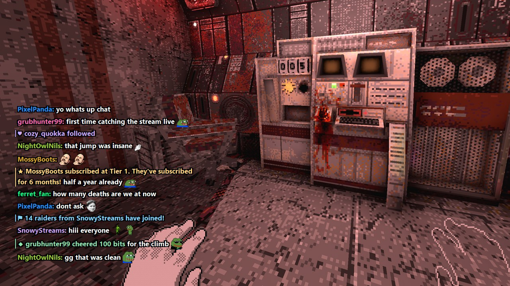
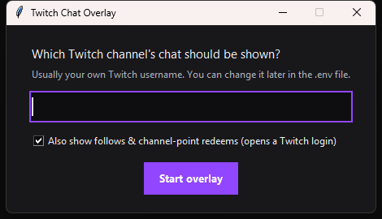
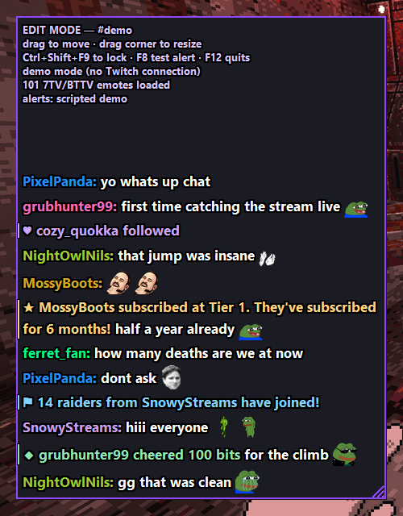
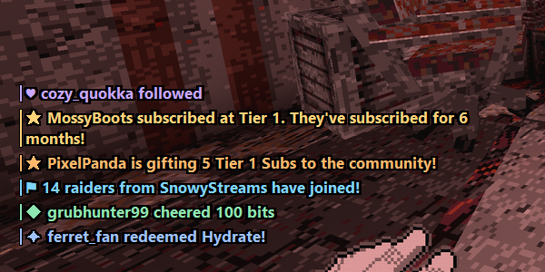
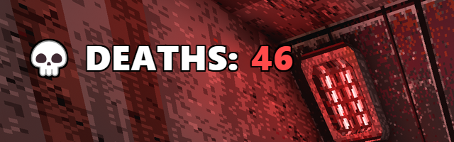

# Twitch Chat Overlay

A small, see-through Twitch chat window that sits **on top of your games** without getting in the way. Clicks go straight through it to the game. It's meant for streamers who want to read chat without alt-tabbing.



- Chat with name colors and a black outline, so it stays readable on any background
- **Twitch, 7TV and BTTV emotes**, including animated ones
- Quiet **alerts** for follows, subs, gift subs, raids, bits and channel points: one colored line and a soft chime
- Messages that mods delete, or from users they ban or time out, disappear from the overlay too
- Hides `!commands` and common bots (Nightbot, StreamElements, …)
- Bonus: an OBS **death counter** your mods control from chat

Windows 10/11 only.

---

## Quick start (.exe version)

1. Download **`TwitchChatOverlay-win64.zip`** from the [latest release](https://github.com/mentulatv/twitch-chat-overlay/releases/latest) and unzip it anywhere, for example `Documents\TwitchChatOverlay`.
2. Double-click **`TwitchChatOverlay.exe`**. The first time, it asks for your channel name.<br>
   
3. Chat appears on the left side of your screen. Press **Ctrl+Shift+F9** to move or resize it, then press it again to lock it in place.

> Windows may show "Windows protected your PC", because the program isn't code-signed.
> Click **More info → Run anyway**.

Your game must run in **Borderless** or **Windowed fullscreen**. No overlay can draw over exclusive fullscreen.

## Hotkeys

| Keys | Action |
|---|---|
| **Ctrl+Shift+F9** | Edit mode: drag to move, drag the bottom-right corner to resize. Press again to lock. |
| Ctrl+Shift+F10 | Hide / show |
| Ctrl+Shift+F11 | Clear chat |
| Ctrl+Shift+F8 | Show a test alert (cycles through the types, with sound) |
| Ctrl+Shift+F12 | Quit |

Edit mode also shows the connection status: chat, emotes and alerts.



## Settings

Two files next to the program. Both are plain text, so edit them with Notepad and restart the overlay.

### `.env` (your account)

```
TWITCH_CHANNEL=yourname
TWITCH_CLIENT_ID=            # leave empty (uses the built-in app)
TWITCH_CLIENT_SECRET=        # leave empty
```

### `config.json` (looks and behavior)

This file is created on first run. It's also where the overlay saves its position and size.

| Setting | Default | What it does |
|---|---|---|
| `font_family` / `font_size` / `font_weight` | Segoe UI / 13 / bold | Text style |
| `outline_px` | 2 | Thickness of the black text outline |
| `fade_seconds` | 60 | How long chat messages stay (0 = until pushed out) |
| `alert_fade_seconds` | 180 | How long alerts stay |
| `hide_commands` | true | Hide messages starting with `!` |
| `hide_users` | bots | Usernames to never show |
| `show_badges` | true | ★ broadcaster, ⚔ mod, ♦ VIP in front of names |
| `emotes` | true | Show emotes as images |
| `emote_height` | 0 | Emote size in pixels (0 = match the text) |
| `alerts` | true | Turn all alerts on or off |
| `alert_types` | all true | Turn single types on or off: `follow`, `sub`, `gift`, `raid`, `bits`, `redeem` |
| `alert_sound` / `alert_volume` | true / 0.35 | Chime on or off, volume from 0 to 1 |
| `alert_sound_file` | "" | Path to your own `.wav` instead of the chime |

## Follow & channel-point alerts



Subs, gift subs, raids and bits work straight away. **Follows and channel-point redemptions** need a one-time Twitch login:

- On first launch, leave the **"Also show follows & channel-point redeems"** box ticked, **or**
- run **`Login to Twitch.bat`** any time later (`login.bat` in the source version).

A window shows a short code and opens Twitch. Log in as the channel owner (or one of its mods) and confirm the code. Alerts start within a minute. Your password is never typed into this program: you approve it on twitch.tv, and a login token is saved as `.tokens.json`. **Never share `.tokens.json`.**

To use your own Twitch app instead of the built-in one, put its Client ID in `.env` and log in again.

## Death counter for OBS (optional)



1. In OBS: **+ → Browser**, and untick "Local file".
2. URL: `http://absolute/C:/path/to/deaths.html?channel=yourname`. Use the real path to the file, with forward slashes.
3. Width 520, height 110.

Only mods and the broadcaster can change it:

| Chat command | Effect |
|---|---|
| `!death` or `!d+` | +1 |
| `!death-` or `!d-` | −1 |
| `!deaths set 12` | Set to a number |
| `!deathreset` | Back to 0 |

Extra URL options: `&label=FAILS` changes the text, `&size=36` changes the size, and `&key=eldenring` keeps a separate count per game. The count survives OBS restarts.

## Start automatically with Windows

Press **Win+R**, type `shell:startup`, and put a shortcut to `TwitchChatOverlay.exe` in that folder (or to `start.bat` in the source version).

---

## Running from source

Needs Python 3.10+ from python.org.

```
setup.bat      # one time: makes .venv and installs Pillow + websocket-client
start.bat      # run the overlay
login.bat      # Twitch login for follow alerts
build.bat      # build the .exe + zip into dist\
```

Files: `overlay.py` (window, chat, emotes), `alerts.py` (alerts, Twitch login, chime), `settings.py` (file locations, `.env`), `deaths.html` (OBS counter), `demo.py` (scripted chat for screenshots: `python overlay.py --demo`, add `--edit` or `--alerts`).

The screenshots use made-up usernames. The game in the background is *White Knuckle*.

## Troubleshooting

- **Nothing shows up.** It only shows *new* messages, so type something in your chat. Press Ctrl+Shift+F9 to see the status.
- **It's hidden behind the game.** Switch the game to borderless or windowed fullscreen.
- **"hotkey … is taken by another app".** Another program uses that key combo. Everything else still works.
- **Follows don't show.** Check the status in edit mode. "not logged in" means run Login to Twitch. The login must be the channel owner or a mod.
- **It won't start a second time.** Only one copy can run at once. Quit the old one with Ctrl+Shift+F12, or end it in Task Manager.
